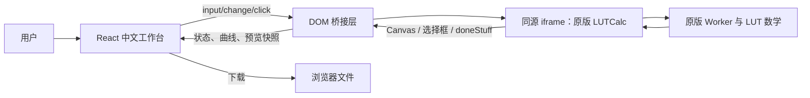

# LUTCalc 中文工作台技术文档

> **文档定位**：本文面向维护者、二次开发者和发布负责人，描述当前 `lutcalc-redesign` 的实际实现，而非原版 LUTCalc 的通用说明书。文中“引擎”均指项目内同源嵌入的原版 LUTCalc；“工作台”指 React 中文界面。

| 项目 | 当前值 |
|---|---|
| 项目目录 | `/home/ubuntu/lutcalc-redesign` |
| Web 栈 | React 19、TypeScript、Vite、Tailwind CSS 4、Radix UI 组件依赖 |
| 计算核心 | `client/public/lutcalc/` 内的原版 LUTCalc 脚本、Worker 与 Canvas |
| 前端入口 | `client/src/pages/Home.tsx` |
| 调整项组件 | `client/src/components/NativeAdjustments.tsx` |
| 主题注册 | `client/src/themes/themeRegistry.ts` |
| 当前内置主题 | Ubuntu、KDE、macOS、Omarchy；均支持亮/暗模式 |
| 发布方式 | Vite 静态产物 + 极简 Express 静态服务 |
| 最近发布版本 | `361f144a` |

## 1. 目标、边界与设计原则

该项目的目标不是重新实现色彩计算数学，而是在保留原版 LUTCalc 计算、分析、预览和导出能力的前提下，提供完整简体中文、本地主题化、参数结构更统一的工作台。原版 LUTCalc 是该项目嵌入的计算与分析基础；其许可证文本已随项目保留。[1] [2]

> **关键原则**：可见界面属于 React；计算真源属于同源 iframe。React 不应以自造公式替换原版引擎，也不应把文件选择、按钮点击或短延时误判为 LUT 分析完成。

系统采用“外壳—桥接—引擎”三层划分。外壳负责中文 UI、状态和本地工具；桥接负责将 React 控件同步到原版 DOM，并把引擎 Canvas 和分析完成事件同步回外壳；引擎负责 LUT 生成、LUTAnalyst、曲线、预览及原版导出。

| 层级 | 责任 | 不应承担的责任 |
|---|---|---|
| React 工作台 | 参数卡、工具中心、主题、提示、元数据审计、流程和配置文件的本地保存 | 自行计算 LUT 或伪造分析结果 |
| 同源桥接 | DOM 选择器映射、跨文档事件、Canvas 快照、状态轮询 | 以固定时间替代完成信号 |
| 原版 LUTCalc | Gamma/Gamut 管线、LUTAnalyst、Worker 运算、曲线和下载 | 直接决定工作台视觉与中文内容 |

## 2. 目录与运行时拓扑

```text
lutcalc-redesign/
├── client/
│   ├── src/
│   │   ├── pages/Home.tsx                 # 主工作台与桥接主控
│   │   ├── components/NativeAdjustments.tsx # 原生调整项与 LUTAnalyst UI
│   │   ├── themes/                        # 主题 JSON、Schema 与注册表
│   │   └── index.css                      # 全局样式与最终主题覆盖
│   └── public/lutcalc/                    # 原版 LUTCalc 静态资源与许可证
├── research/                              # Chromium/CDP 回归与数值比较脚本
├── server/index.ts                         # 生产静态文件服务
├── docs/                                  # 本文档及用户手册
└── package.json
```

浏览器首先加载 React 根页面。`Home.tsx` 创建一个不可作为旧 UI 展示的同源 iframe，其源为 `/lutcalc/index.html?embed=adjustments&workspaceEmbed=20260818-5`。iframe 仍加载原版脚本及 Worker，因此其 DOM、Canvas 和 `TWKLA` 原型可在同源条件下被工作台读取、调用和补充事件。



## 3. 前端构成与状态模型

### 3.1 主工作台

`Home.tsx` 是唯一的主控页面。它维护五类状态：引擎可用性、原版参数快照、输出配置、预览快照及本地工具状态。`engineState` 使用 `EngineField` 记录相机、记录 Gamma/Gamut、输出 Gamma/Gamut、标题、格式与硬裁切；`choices` 从原版 `<select>` 实时读取，因此 React 不维护简化的静态相机或 Gamma 列表。

| 状态 | 用途 | 数据来源 |
|---|---|---|
| `engineReady` | 控制可操作性与连接提示 | iframe 初次水合成功 |
| `engineState` / `choices` | 原生参数卡的值与候选项 | 原版 `#box-cam`、`#box-gam`、`#box-lut` DOM |
| `outputConfig` | 1D/3D、尺寸、范围、用途和 0%–100% 选项 | 原版 LUT 输出区域 radio/checkbox |
| `previewSrc` / `enginePreviewSrc` | 曲线与原版预览图像 | 原版 Canvas `toDataURL()` |
| `lutAnalysis` | 外部 LUT 分析进度、LA 输出、采样摘要 | 原版 LUTAnalyst 完成后的验证结果 |
| `savedWorkflows` / `profiles` | 本地流程与曲线配置 | `localStorage` |

`hydrateEngine()` 是工作台的核心读同步。它给原版控件补充稳定的 `data-lutcalc-workflow-id`，读取必要的原版 DOM 索引，生成 React 状态快照，并在快照变化时才触发更新。选择器索引与原版界面结构紧耦合，因此升级原版资源后应首先检查该函数。

### 3.2 原生调整项

`NativeAdjustments.tsx` 将常规调整模块组织为连续的原版式条带。常规模块通过复选框控制是否启用和是否显示参数区，不再额外保留与复选框重复的展开箭头；LUT 解析器作为调整项末尾的独立工具条，保留展开箭头。

控制同步入口为 `onToggle`、`onControlChange` 和 `onLutAnalystConfigChange`。前两者由 `Home.tsx` 映射到原版 `#box-twk` 内对应模块、范围滑块、数字输入或下拉框；映射字典的字符串键应与 UI 中的中文模块名保持一致。新增或重命名模块时，必须同时更新组件定义、`moduleIndex`、`precise` 映射和回归路径。

## 4. 同源引擎桥接

### 4.1 iframe 布局隔离

工作台载入 iframe 后执行三步：

1. `verifyAdjustmentEmbed()` 确认 iframe 已进入 `embed-adjustments` 模式；失败时只重载一次指定嵌入地址。
2. `enforceAdjustmentEmbedLayout()` 隐藏原版标题、相机、Gamma、LUT、右栏和页脚区域，仅保留调整项所需的主体结构。
3. `ResizeObserver` 观察 `#box-twk`，将 iframe 高度同步到实际调整项高度，避免展开内容被裁切。

这不是安全沙箱设计，而是为了保留原版计算能力的 **同源兼容层**。任何把 iframe 改为跨域地址的改动都会破坏 DOM 调用、Canvas 快照、文件输入注入和原型级完成事件。

### 4.2 参数同步协议

React 写入原版控件时采用“设置值 + 派发 iframe 所属窗口的 `input` / `change`”模式。不能只改 `value`，因为原版监听的是 DOM 事件。对于 iframe 内对象，不能使用父窗口的 `instanceof HTMLSelectElement`，应通过 `tagName` 判断，以免因跨 Window 原型不同而失效。

| React 操作 | 原版目标 | 关键动作 |
|---|---|---|
| 相机、Gamma/Gamut、标题、格式 | `#box-cam` / `#box-gam` / `#box-lut` | 设置 `value` 后派发事件 |
| 输出维度、范围、用途 | `#box-lut` 内无 id radio | 按 `name` 与原版顺序选择 |
| 调整项启用 | `#box-twk .tweakholder` checkbox | 与原版模块标题匹配 |
| 常规调整参数 | 对应模块 range/number/select | 使用受控 setter 后派发事件 |
| LUTAnalyst 设置 | `#box-twk` 第 20/22 个 select 与相关 radio | 按原版 LUTAnalyst 索引映射 |

> **维护警告**：索引 `20` 与 `22` 分别对应当前原版 LUTAnalyst 的输入 Gamma 和输入 Gamut。若更换原版 LUTCalc 版本，必须重新审计选择器顺序，不可假定该数字永久稳定。

### 4.3 事件、轮询与预览刷新

工作台对 iframe 捕获 `input`、`change`、`click`，并每 1.2 秒执行一次低频水合与 Canvas 刷新。这一轮询是容错手段，不是 LUT 分析完成依据。用户操作和原版 Worker 更新均可能异步发生，因此桥接还定义了短延时刷新序列 `180/520/1100 ms`。

曲线预览由 `#can-stop-bgrnd`、`#can-stop-clip`、`#can-stop-rec`、`#can-stop-out` 叠加为新 Canvas，并序列化为 PNG；原版预览、波形、矢量示波和 RGB Parade 则分别读取 `#can-preview`、`#can-waveform`、`#can-vector`、`#can-parade`。工作台展示的并非手写示意图，而是原版 Canvas 快照。

## 5. LUTAnalyst 分析闭环

### 5.1 为什么不能以文件 change 视为完成

外部 LUT 文件被选择时，原版 LUTAnalyst 才开始读取；真正的 Gamma/Gamut 分析、Worker 回传、LA 输出注册及曲线重算在之后发生。原版的 `TWKLA.doneStuff()` 在分析完成后选择末尾的 `LA - 标题` 输出项，并触发 Gamma/Gamut 的后续变更。[3]

工作台在 iframe 内对 `TWKLA.prototype.gotFile`、`doStuff`、`doneStuff` 包装通知。消息格式为：

```ts
{ type: "lutcalc:adjustment-complete", method: "doneStuff" }
```

收到 `doneStuff` 只是开始确认。`scheduleLutAnalysisCompletion()` 在多个时间点重新水合、刷新曲线与原版预览，再由 `captureCompletedLutAnalysis()` 验证输出 Gamma 和 Gamut **均**以 `LA - ` 开头。只有成对条件成立，才将 `lutAnalysis.status` 标记为 `ready`；最后一次仍未成立时，状态为 `error`，不得把默认 `S-Log3` 误报为完成。

### 5.2 文件审计与可见结果

原生 LUTAnalyst 文件输入接受 `.cube`、`.3dl`、`.lut`、`.txt`。读取文本后会解析以 `#` 标记的 `title`、`model`、`Gamma` 和 `Gamut`，读取 `LUT_3D_SIZE` 或 `LUT_1D_SIZE`，计算 SHA-256，并检查 3D 网格声明、数据行数量和 RGB 数值有效性。

对于包含 F-Log2/F-Log2C 与 F-GamutC/F-Log Gamut 标记的文件，界面会尝试选择原版目录中存在的 `Fujifilm F-Log2` / `Fujifilm F-Log Gamut`。原始元数据仍会保留，并显示“标准选项映射而非严格同名空间”的提示。分析成功后还显示端点、中点、终点传递函数的 IRE 与 10-bit 编码摘要；该数据来自原版 `lutInputs.lutAnalyst.getL()` 返回的传递函数缓冲区，而非工作台自行拟合。

### 5.3 标题和导出语义

LUT 文件可同时有原始文件名、文件头 `#title`、分析标题和最终下载文件名。当前工作台优先使用文件头标题回写 LUTAnalyst 标题；随后多次同步标题到原版分析表单，以使 `LA - 标题`、输出状态、Cube TITLE 和下载名尽可能一致。流程/配置导出文件名会执行字符清洗，避免路径或不兼容字符。

## 6. 主题系统

主题定义采用 JSON，统一由 `themeRegistry.ts` 转为 CSS 自定义属性。当前只注册 Ubuntu、KDE、macOS、Omarchy 四套主题。主题键 `lutcalc-workbench-theme` 和模式键 `lutcalc-workbench-mode` 保存于 `localStorage`；已删除的 `leica` / `lumix` 偏好会被读取函数迁移为 `ubuntu`。

| 令牌类别 | 示例 | 作用 |
|---|---|---|
| 表面 | `--theme-canvas`、`--theme-card`、`--theme-surface` | 页面、卡片、区域背景 |
| 前景 | `--theme-text`、`--theme-muted` | 普通与弱化文本 |
| 边界 | `--theme-border`、`--theme-shadow`、`--theme-radius` | 分隔、投影、圆角 |
| 强调与状态 | `--theme-accent`、`--theme-success`、`--theme-danger` | 按钮、焦点、提示、诊断 |
| 控件 | `--theme-control`、`--theme-input`、`--theme-focus` | 可交互控件 |

`applyWorkbenchTheme()` 必须同时作用于父文档和 iframe 文档，以保证调整项与工作台使用同一组变量。维护 CSS 时，以 `index.css` 后段的最终覆盖层为准；项目历史上保留了早期视觉实验的规则，不能仅凭文件靠前位置判断最终样式。

## 7. 本地工作流与曲线配置

工作流使用 `lutcalc-apple-workflows` 保存。事件记录包括操作类型、稳定选择器、标签、值与 checked 状态，最多保留 100 步。执行流程时会立即关闭记录标志，防止回放动作写回自身；每步间隔约 80 ms。工作流 JSON 仅是浏览器端操作录制，不是可移植的数学 LUT 描述。

曲线配置使用 `lutcalc-log-gamma-profiles` 保存，并以 `lutcalc-log-gamma-profile` / `version: 1` 为 schema。当前实现支持储存、校验、导入、删除和导出两类描述：采样表曲线与公式曲线。**重要限制是：该配置目前是独立资料库，尚未注册为原版 LUTCalc 的相机、Gamma 或 Gamut 选项。** 因此它可被管理与分享，但不会自动改变原版计算管线。

## 8. 构建、部署与缓存

开发命令为 `pnpm dev`，类型检查为 `pnpm check`，生产构建为 `pnpm build`，生产启动为 `pnpm start`。构建过程先执行 Vite，再用 esbuild 打包 `server/index.ts`。

Express 服务静态提供 `dist/public`。根页面、HTML 和 `/lutcalc/` 路径使用 `Cache-Control: no-store, max-age=0, must-revalidate`，目的是避免工作台或同源引擎更新后被浏览器继续复用旧版完整 iframe。未知前端路由回退到 `index.html`。

每次成功保存检查点会自动发布；不要把“保存检查点”当成纯本地存档操作。发布前应确认生产构建和核心回归通过。

## 9. 测试策略与发布门槛

| 层级 | 命令或工具 | 通过标准 |
|---|---|---|
| 静态类型 | `pnpm check` | `tsc --noEmit` 无错误 |
| 构建 | `pnpm build` | Vite 与服务入口打包成功 |
| Classic Neg 分析 | `python3 research/cdp_test_classic_neg_analysis.py` | LA Gamma/Gamut 成对注册、曲线 Canvas 改变、可见元数据/摘要存在 |
| 主题迁移 | `python3 research/cdp_test_theme_migration.py` | 旧 leica/lumix 偏好回退 Ubuntu，选择器仅四主题 |
| Cube 数值比较 | `research/compare_cube_luts.py` | 输出 MAE、RMSE、P95、最大误差及灰阶/色块差异 |

Classic Neg 回归会在 headless Chromium 中使用真实 65³ 用户样本，经过可见 React 文件输入入口上传，选择 Fujifilm F-Log2 / F-Log Gamut，点击“分析 LUT 并应用当前输出”，随后等待隐藏引擎和可见外壳同时满足多个条件。它不是只检查按钮点击或 DOM 是否挂载的浅层测试。

建议的发布顺序如下：先运行类型检查与构建；再运行 Classic Neg 与主题迁移回归；若涉及输出数学，再做原版/工作台 Cube 数值比较；最后保存检查点。截图采集目前在部分运行环境可能失败，因此不能将其作为唯一验收依据，但在可用时仍应执行人工界面复核。

## 10. 常见故障与排查

| 现象 | 优先检查 | 常见原因 |
|---|---|---|
| 调整项无响应 | iframe 是否同源、`embed-adjustments` 是否存在 | iframe 地址或原版 DOM 结构改变 |
| 分析后仍是 S-Log3 | LA Gamma/Gamut 是否同时以 `LA - ` 开头 | 完成事件过早、标题/选项未回写、分析失败 |
| 曲线未变 | `#can-stop-*` 是否有尺寸、刷新是否在分析完成后 | 只监听 file change 或延时过短 |
| 原版预览空白 | `#can-preview` 与 scopes Canvas 是否生成 | 预览未显示、资源未加载或 Canvas 尚未绘制 |
| 某主题颜色不一致 | 是否使用 `--theme-*` 令牌 | CSS 中残留硬编码色或 iframe 未应用主题 |
| 刷新后主题失效 | localStorage 值是否为已删除 ID | 应由 `readStoredThemeId()` 自动迁移到 Ubuntu |
| 自定义配置未出现在 Gamma 列表 | 这是当前功能边界 | 配置库尚未实现原版引擎注册层 |

## 11. 二次开发准则

扩展主控参数前，先在原版 iframe 中找到真实控件与事件，再将其纳入 `fieldNode()`、`hydrateEngine()` 与写同步函数。扩展调整项前，先确认原版模块的 DOM 顺序、控件类型和默认值。扩展 LUTAnalyst 前，必须保留 `doneStuff` 级的完成检测；不要删除 LA 成对输出验证。

新增主题只可使用标准 JSON 结构并注册到 `BUILTIN_THEMES`；需要同时测试父页面和 iframe。新增配置文件字段时，应同步更新 TypeScript 类型、`validateProfile()`、导入错误消息、导出兼容性和用户手册。任何涉及原版资源、许可证或分发边界的改动，均应保留原始版权和 GPL-2.0 相关文件，并根据实际发布方式复核合规义务。[1] [2]

## 12. 已知限制

当前项目是前端工作台，不提供服务端数据库、用户账号、多人协作或云端保存。流程和曲线配置由浏览器 localStorage 保存，清理站点数据会丢失未导出的条目。Canvas 快照来自原版引擎，因此可作为真实结果显示，但不是可编辑的矢量曲线。高级设置中的部分说明性开关尚未逐项映射到原版参数。自定义曲线配置尚未进入原版 Gamma/Gamut 选项目录。

同时，应注意项目根 `package.json` 的元数据许可证与嵌入原版资源的 GPL-2.0 许可证并非同一层面的声明。发布、分发或将两者合并为衍生作品时，应由负责人依据实际代码与资源边界进行许可证复核；本文不构成法律意见。

## 参考资料

[1]: https://github.com/cameramanben/LUTCalc "原版 LUTCalc 源代码仓库"

[2]: https://www.gnu.org/licenses/old-licenses/gpl-2.0.html "GNU General Public License version 2.0"

[3]: ../client/public/lutcalc/js/twk-la.js "项目内原版 LUTAnalyst 控件与 doneStuff 生命周期"

[4]: ../client/src/pages/Home.tsx "工作台、同源桥接、预览与分析状态实现"

[5]: ../client/src/components/NativeAdjustments.tsx "原生调整项、文件审计与可见分析结果"

[6]: ../client/src/themes/themeRegistry.ts "主题令牌与旧主题偏好迁移"
